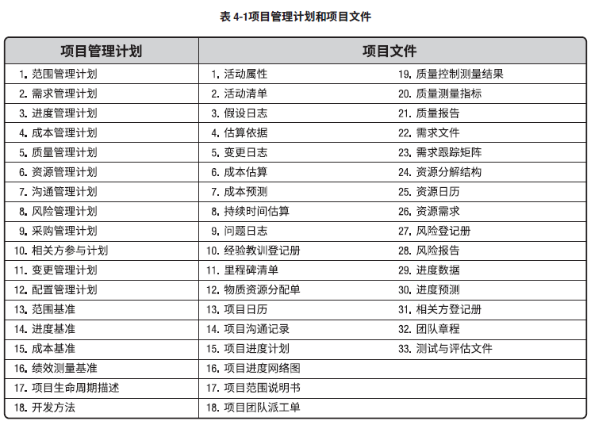
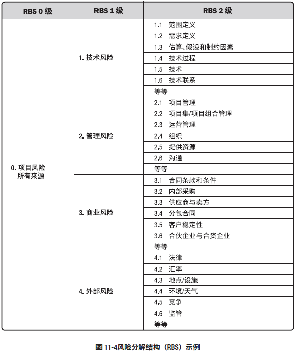
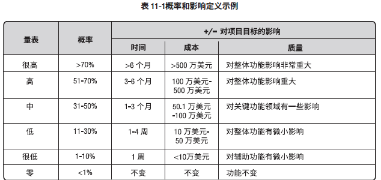
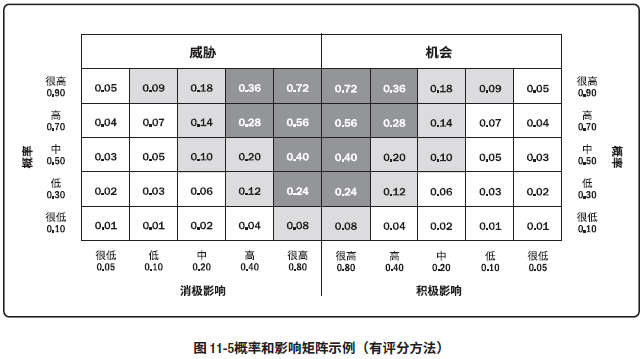
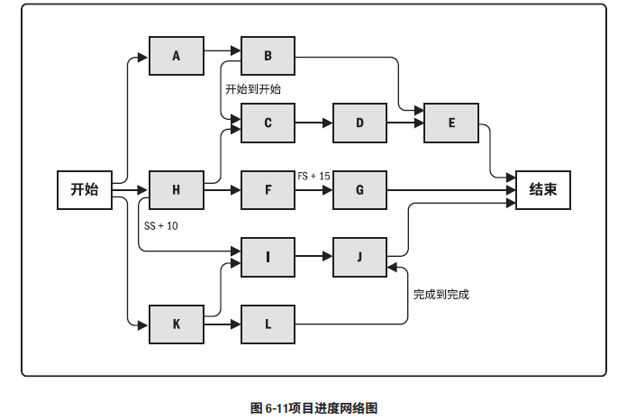
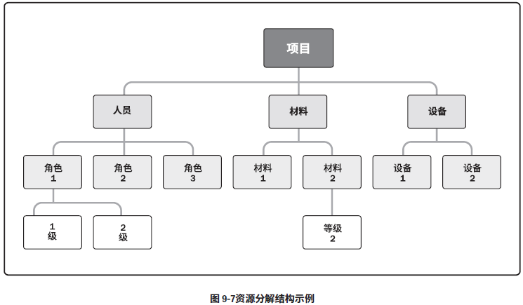

#名词解释

##项目管理计划和项目文件

####项目管理计划

  * 范围管理计划：描述如何定义、制定、监督、控制和确认项目范围。需要对下列工作的管理过程做出规定
    * 制定项目范围说明书
    * 根据项目范围说明书创建WBS
    * 确定如何审批和维护范围基准
    * 正式验收已完成的项目可交付成果
  * 需求管理计划：描述如何分析、记录和管理项目和产品需求。主要内容：
    * 如何规划、跟踪和报告各种需求活动
    * 配置管理活动，如：如何启动变更，如何分析影响，如何追溯、跟踪和报告，如何变更审批权限
    * 需求优先级排序过程
    * 测量指标及使用这些指标的理由
    * 哪些需求将被列入跟踪矩阵的跟踪结构
  * 进度管理计划：编制、监督和控制项目进度建立准则和明确活动。主要内容：
    * 项目进度模型制定：需要规定用于制定项目进度模型的进度规划方法论和工具
    * 进度计划的发布和迭代长度：使用适应型生命周期时，指定固定时间发布时段、阶段和迭代。
    * 准确度：定义需要规划活动持续时间估算的可接受区间，以及允许的应急储备数量。
    * 计量单位：每种资源的计量单位
    * 组织程序链接：WBS为进度计划提供了框架，保证了与估算及相应进度计划的协调性
    * 项目进度模型维护：在项目执行期间，如何在进度模型中更新项目状态，记录项目进展。
    * 控制临界值：规定偏差临界值，用于监督进度绩效。在采取某种措施前，允许出现的最大差异。
    * 绩效测量规则。规定用于绩效测量的挣值管理规则或其他测量规则。
    * 报告格式：各种进度报告的格式和编制频率。
  * 成本管理计划：描述如何规划、安排和控制项目成本。主要内容：
    * 计量单位：每种资源的计量单位
    * 精确度：根据活动范围和项目规模，设定成本估算向上或向下取整程度
    * 准确度：为活动成本估算规定一个可接受区间，包括一定数量的应急储备
    * 组织程序链接：WBS为成本管理计划提供了框架，据此规范的开展成本估算、预算和控制。
    * 控制临界值：规定偏差临界值，用于监督成本绩效。在采取某种措施前，允许出现的最大差异。
    * 绩效测量规则：规定用于绩效测量的挣值管理规则，例如使用的EVM技术，跟踪方法，定义WBS中用于绩效测量的控制账户。
    * 报告格式：各种成本报告的格式和编制频率
  * 质量管理计划：描述如何实施适用的政策、程序和指南以实现质量目标。主要内容：
    * 项目采用的质量标准
    * 项目的质量目标
    * 质量角色与职责
    * 需要质量审查的项目可交付成果和过程
    * 为项目规划的质量控制和质量管理活动
    * 项目使用的质量工具
    * 与项目有关的主要程序。（处理不符合要求的情况，纠正措施程序，持续改进程序）
  * 资源管理计划：如何分类、分配、管理和释放项目资源的指南。
    * 识别资源：识别和量化项目所需的团队和实物资源的方法
    * 获取资源：如何获取项目所需的团队和实物资源的指南
    * 角色：某人承担的职务或分配给某人的职务
    * 职权：使用项目资源、做出决策、签字批准、验收可交付成果并影响他人开展项目工作的权力。
    * 职责：为完成项目活动，项目团队成员必须履行的职责和工作
    * 能力：为完成项目活动，项目团队成员必须具备的技能和才干。
    * 项目组织图：以图形的方式展示项目团队成员及报告关系。
    * 项目团队资源管理：如何定义、配备、管理和最终遣散项目团队资源的指南
    * 培训：针对项目成员的培训策略
    * 团队建设：团队建设的方法
    * 资源控制：依据需要确保实物资源充足可用、并为项目需求优化实物资源采购，而采用的方法。
    * 认可计划：给予团队成员哪些认可和奖励，以及何时给予。
  * 沟通管理计划：描述如何规划、结构化、执行与监督项目沟通，提高沟通的有效性。主要内容：
    * 相关方的沟通需求
    * 需沟通的信息，包括语言、形式、内容和详细程度
    * 上报步骤
    * 发布信息的原因
    * 发布所需信息、确认已收到，或做出回应的时限和频率
    * 负责沟通相关信息的人员
    * 负责授权薄膜信息发布的人员
    * 接受信息的人员或群体，包括他们的需要、需求和期望
    * 用于传递信息的人员或群体
    * 用于传递信息的方法或技术
    * 为沟通活动非陪的资源
    * 更新与优化沟通管理计划的方法
    * 通用术语表
    * 项目信息流向图、工作流程、报告清单和会议计划等
    * 来自法律法规、技术、组织政策等的制约因素。
  * 风险管理计划：描述如何安排与实施风险管理活动，主要内容：
    * 风险管理战略：管理本项目风险的一般方法
    * 方法论：确定用于开展本项目的风险管理的具体方法、工具及数据来源
    * 角色与职责：确定每项风险管理的具体方法、工具及数据来源
    * 资金：确定开展项目风险管理活动所需的资金，并制定应急储备和管理储备的使用方案
    * 时间安排：在项目声明周期中实施项目风险管理过程的时间和频率，确定风险管理活动并纳入项目进度计划
    * 风险类别：对单个项目风险进行分类的方式。通常借助风险分解结构（RBS）来构建风险类别，它是潜在风险来源的层级展现。

    * 相关方风险偏好：关键相关方的风险偏好，可以表述成可测量的风险临界值
    * 风险概率和影响定义：组织和关键相关方的风险偏好和临界值，来制定风险概率和影响定义。

    * 概率和影响矩阵：在项目开始前确定优先级排序规则，并纳入组织过程资产，为具体项目量身定制优先级排序规则。
    * 报告格式：确定将如何记录、分析和沟通项目风险管理过程的结果。
    * 跟踪：确定将如何记录风险活动，以及将如何审计风险的管理过程。

  * 采购管理计划：包含采购过程中开展的各种活动。主要内容：
    * 如何协调采购与项目的其他工作，例如，项目进度计划制定和控制
    * 开展重要采购活动的时间表
    * 用于管理采购合同的采购测量指标
    * 与采购相关的相关方橘色和职责
    * 影响采购工作的制约因素和假设条件
    * 司法管辖权和付款货币
    * 是否需要编制独立估算，是否将其作为评价标准
    * 风险管理事项，履行保函或保险合同的要求，减轻某些项目风险
    * 使用的预审的合格的卖方。
  * 相关方参与计划：促进相关方有效参与决策和执行的策略和行动。
  * 变更管理计划：描述整个项目期间如何正式审批和采纳变更请求。
  * 配置管理计划：描述如何记录和更新项目的特定信息，以及记录和更新哪些信息，以保持产品、服务或成果的一致性和有效性。
  * 范围基准：经过批准的范围说明书、WBS和相应的WBS词典，只有通过正式的变更程序才可进行变更，它被用作比较的基础。
  * 进度基准：经过批准的进度模型，只有通过正式的变更控制程序才可变更，用作与实际结果进行比较的依据。
  * 成本基准：经过批准、按时间段分配的项目预算，不包括任何管理储备，只有通过正式的变更控制程序才可变更，用作与实际结果进行比较的依据。
  * 绩效测量基准：经过整合的项目范围、进度和成本计划，用作项目执行的比较依据，以测量和管理项目绩效。
  * 项目声明周期描述：描述项目从开始到结束所经历的一系列阶段。
  * 开发方法：描述产品、服务或成果的开发方法。（预测/迭代/敏捷或混合型模式）

####项目文件
  * 活动属性：活动具有的多重属性，用来扩充对活动的描述，活动属性随时间演进。
  * 活动清单：项目所需的进度活动。
  * 假设日志：记录整个项目声明周期中的所有假设条件和制约因素。
  * 估算依据：成本估算所需的支持信息的数量和种类，包括
    * 关于估算依据的文件
    * 全部假设条件的文件
    * 已知的制约因素文件
    * 已识别的、在估算成本应考虑的风险文件
    * 估算区间说明
    * 最终估算的置信水平说明
  * 变更日志：记录项目期间发生的变更
  * 成本估算：完成项目可能需要的成本、应对已识别风险的应急储备，应对计划外工作的管理储备的量化估算。（间接成本也包括）
  * 成本预测：完工估算（EAC）值。
  * 持续时间估算：对完成某项活动、阶段或项目所需工作的时段数的定量评估，不包括任何滞后量，可以指出一定的变动区间。
  * 问题日志：记录和跟进所有问题的文件。
  * 经验教训登记册：包含情况（包括相关的影响、建议和行动方案）和类别的描述，记录遇到的挑战、问题、意识到的风险和机会
  * 里程碑清单：项目中的重要时点或事件。指明是强制性（合同要求）还是选择性的（根据历史信息确定）。
  * 物质资源分配单：
  * 项目日历：规定可以开展进度活动的可用工作日和工作班次，把可用于开展进度活动的时间段与不可用的时间段区分开来。
  * 项目沟通计划
  * 项目进度网络图：表示项目进度活动之间的逻辑关系的图形。

  * 项目范围说明书：对项目范围、主要可交付成果、假设条件和制约因素的描述。（描述要做和不做的工作详细程度）
  * 项目团队派工单：记录了团队成员及其在项目中的角色和职责，包括团队名录。
  * 质量控制测量结果：对质量控制活动的结果的书面记录，
  * 质量测量指标：描述项目或产品属性、以及控制质量过程将如何验证符合程度。
  * 质量报告：报告质量管理问题、纠正措施建议以及在质量控制活动中所发现的其他情况的一种文件，也可以包括对过程、项目和产品的改进建议。
  * 需求文件：描述单一需求将如何项目与项目相关的业务需求。
  * 需求跟踪矩阵：把产品需求从来源连接到能满足可交付成果的一种表格。
  * 资源分解结构：资源依类别和类型的层级展现

  * 资源日历：每种具体资源可用时的工作日、班次、正常营业的上下班时间、周末和公共假期。
  * 资源需求：识别了各个工作包中每个活动所需资源类型和数量，可以汇总这些需求，以估算每个工作包、每个WBS分支以及整个项目所需的资源。
  * 风险登记册：记录已识别单个项目风险的详细信息。内容包括：已识别的风险清单/潜在的风险责任人/潜在风险应对措施清单
  * 风险报告：提供关于整个项目风险的信息，关于已识别的单个项目风险的概述信息。包括：整体项目风险的来源/已识别的单个项目风险的概述信息。
  * 进度数据：描述和控制进度计划的信息集合。至少包括进度里程碑、进度活动、活动属性和已知的全部假设条件与制约因素。
  * 进度预测：根据已有的信息和知识，对项目未来的情况和事件进行估算或预计。
  * 相关方登记册：识别相关方过程的主要输出。记录关于已识别相关方的信息。包括身份信息/评估信息/相关方分类
  * 团队章程：为团队创建价值观、共识和工作指南的文件。
  * 测试与评估文件：描述用于确定产品是否达到管理质量计划中规定质量目标的各种活动的项目文件。

##其他

项目：为了创造独特的产品、服务或成果而进行的临时性工作。
成果性目标：通过项目开发出的满足客户要求的产品、服务或成果。
约束性目标：完成成功性目标所需要的时间、成本以及满足的质量、范围等。
项目管理：将知识、技能、工具与技术应用于项目活动，以满足项目的要求。
项目集：项目集是一组**相互关联**并且被**协调管理**的项目，子项目集和项目集活动，以便获得分别管理无法获得的利益。项目集中可以包括单个项目范围之外的相关工作。
项目组合：项目组合是为了实现战略目标而组合在一起管理的项目、项目集、子项目集合和**运营工作**。
组织战略：组织应对变化、严峻挑战的环境，为求得长期生存和不断发展而进行的总体性谋划。
项目生命周期：项目从开始到结束所经历的一系列阶段。
项目阶段：一组有逻辑关系的项目活动的集合，通常以一个或多个可交付成果的完成为结束。
阶段关口：为做出进入下个阶段，进行整改或结束项目几或项目决定，而开展的阶段末审查。
项目管理过程：旨在创造最终结果的系统化系列活动。以便对一个或多个输入进行加工，生成一个或多个输出。
项目管理过程组：项目管理输入、工具和技术以及输出的逻辑组合。项目管理过程组包括启动、规划、执行、监控和收尾。项目管理过程组不同于项目阶段。
项目管理知识领域：按所需知识内容来定义的项目管理领域，并用其所含过程、实践、输入、输出、工具和技术进行描述。
启动过程组：定义一个新项目或现有项目的一个新阶段，授权开始该项目或阶段的一组过程。
规划过程组：明确项目范围，优化目标，为实现目标制定行动方案的一组过程。
执行过程组：完成项目管理计划中确定的工作，以满足项目要求的一组过程。
监控过程组：跟踪、审查和调整项目进展和绩效，识别必要的计划变更并启动相应变更的一组过程。
收尾过程组：正式完成或项目结束、阶段或合同所执行的过程。
工作绩效数据：在执行项目工作的过程中，从每个正在执行的活动中收集到的原始观察结果和测量值。
工作绩效信息：从各个控制过程中收集并结合相关背景和跨领域关系，进行整合分析而得到的绩效数据。
工作绩效报告：为制定决策、提出问题、采取行动或引起关注，而汇编工作绩效信息，所形成的实物或电子项目文件。
商业论证：从商业的角度提供必要的信息，文档化的经济可行性研究报告，对尚缺乏充分定义的所选方案的收益进行有效性论证，是启动后续项目管理活动的依据。
项目效益管理计划：项目实现效益的方式和时间，以及应制定的效益衡量机制。
项目效益：为发起组织和项目预期受益方创造价值的行动，行为，产品，服务或成果的结果。
项目章程：由项目发起人发布，正式批准项目成立，并授权项目经理动用组织资源开展项目活动的文件。记录了关于项目和项目预期交付的产品、服务或成果的高层信息。
假设日志：记录整个项目生命周期中的所有假设条件和制约因素。
核对单：需要考虑的项目、行动或要点的清单。
项目管理计划：描述如何执行、监控和结束项目的一份文件。
项目成功标准：目标实现、时间、成本、范围和质量等测量指标确定项目是否成功的因素。
事业环境因素：项目团队不能控制的，对项目产生影响、限制或指令作用的各种条件。
组织过程资产：在制定项目章程及以后的项目文件时，任何一种以及所有用于影响项目成功的资产。
项目管理办公室：对项目相关的治理过程进行标准化，并促进资源、方法论、工具和技术共享的一个组织结构。
协议：定义启动项目的初衷。
专家判断：基于某应用领域、知识领域、学科和行业等专业知识而做出的，关于当前活动的合理判断，可以来自具有专业学历、知识、技能、经验或培训经历的任何小组或个人。
指导与管理项目工作：实现项目目标而领导和执行项目管理计划中所确定的工作，并实施已批准的变更过程。
项目信息管理系统（PMIS）:提供信息技术软件工具，自动收集和报告关键绩效指标（KPI）可以是本系统的一项功能。
问题日志：记录和跟进所有问题的项目文件。
变更请求：关于修改任何文件、可交付成果或基准的正式提议。
管理项目知识：使用现有知识并生成新知识，以实现目标，并帮助组织学习的过程。
监控项目工作：跟踪、审查和报告项目整体进展，以实现项目管理计划中确定的绩效目标的过程。
实施整体变更控制：审查所有变更请求、批准变更，管理对可交付成果、项目文件和项目管理计划的变更，并对变更处理结果进行沟通的过程。
规划范围管理：记录如何定义、确认和控制项目范围及产品范围，而创建范围管理计划的过程。
收集需求：为实现项目目标而确定、记录并管理相关方的需求要需求的过程。
定义范围：指定项目和产品详细描述的过程。
创建WBS：将项目可交付成果和项目工作分解为较小的、更易于管理的组件的过程。
确认范围：正式验收已完成的项目可交付成果的过程。
控制范围：监督项目和产品的范围状态，管理范围基准变更的过程。
产品范围：某项产品、服务或成果所具有的特征和功能。
项目范围：为交付具有规定特性与功能的产品、服务或可交付成果而必须完成的工作。有时包括产品范围。
范围管理计划：描述如何定义、监督、控制和确认项目范围。
需求管理计划：描述如何分析、记录和管理项目和产品需求。
WBS：项目团队为实现项目目标、创建所需可交付成果而需要实施的全部工作范围的层级分解。
WBS词典：针对WBS的每个组件，详细描述可交付成果、活动和进度信息的文件。
范围说明书：对项目范围、主要可交付成果、假设条件和制约因素的描述。
