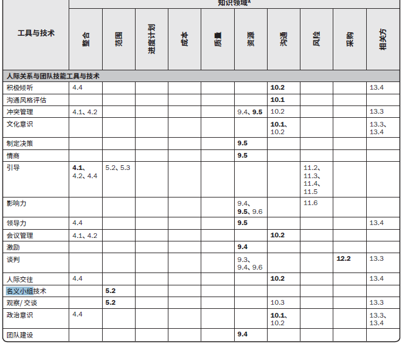

#工具与技术

  * 积极倾听：与说话人互动，并总结对话内容，确保有效的信息交换。
  * 沟通风格评估：规划沟通活动时，用于评估沟通风格并识别偏好的沟通方法、形式和内容的一种技术。常用于**不支持项目的相关方。**找出相关方参与度的差距。通过特别裁剪沟通活动和工件，弥补这种差距。
  * 冲突管理：五种常见的冲突解决方法

|解决方法|用途|
|-|-|
|撤退/回避|从实际或潜在冲突中推出，将问题推迟到准备充分的时候，将问题推给其他人员解决|
|缓和/包容|强调一致而非差异，为维持和谐与关系而退让异步，考虑其他方的需要|
|妥协/调解|为了暂时或部分解决冲突，寻找让各方都一定程度上满意的方案，有时会导致"双输"的局面|
|强迫/命令|以牺牲其他方为代价，推行某一方的观点，只提供赢——输方案，通常是利用权力来强行解决紧急问题，这种方法通常会导致"赢输"局面。|
|合作/解决问题|综合考虑不同观点和意见，采用合作的态度和开放式对话引导各方达成共识和承诺，这种方法可以带来双赢局面。|

  * 文化意识：理解个人、群体和组织之间的差异，根据此来调整项目的沟通策略。最小化因文化差异导致的理解错误和沟通错误。
  * 制定决策：谈判能力以及影响组织与项目管理团队的能力。
  * 情商：识别、评估和管理个人情绪、他人情绪及团体情绪的能力。了解、评估及控制团队成员的情绪，控制团队成员的行为，确认团队成员的关注点及跟踪团队成员的问题，达到减轻压力、加强合作的目的。
  * 引导：有效引导团队活动以达成决定、解决方案或结论的能力。一般是跨职能团队之间的会议。
  * 影响力：在矩阵环境中，项目经理对团队成员通常没有或仅有很小的命令职权，适时影响相关方的能力，加大项目成功几率。主要是：
    * 说服他人，
    * 清晰表达观点和立场
    * 积极且有效的倾听
    * 了解并综合考虑各种观点
    * 收集相关信息，在维护相互信任关系下，解决问题并达成一致意见。
  * 领导力：领导团队、激励团队做好本质工作的能力。
  * 会议管理：采用步骤确保会议高效地达到预期目标
    * 准备并发布会议议程；
    * 确保会议在规定的时间开始和结束；
    * 确保适当参与者受邀并出席
    * 记录所有行动以及分配的行动负责人。
  * 激励：为某人采取行动提供了理由。提高团队参与决策能力并鼓励他们独立工作。
  * 谈判：为了达成协议而进行的讨论。
  * 人际交往：通过与他们人互动信息交流，建立联系。有助于利用非正式组织解决问题，影响相关方的行动，提供相关方对成果的支持，从而改善绩效。
  * 名义小组技术：用于促进头脑风暴的一种技术，通过投票排列最有用的创意，以便进一步开展头脑风暴或优先排序。

##其他工具与技术
  * 亲和图：一种用来对大量创意进行分组，以便进一步审查和分析的技术。
  * 焦点小组：召集预定的相关方和主题专家，了解他们对所讨论的产品、服务或成果的期望和态度的一种启发式技术。
  * 访谈：通过与相关方直接交谈，来获取信息的正式或非正式方法。
  * 政治意识：对正式和非正式的权利关系的认知，以及在这些关系中工作的意愿。有利于根据项目环境和政治环境来规划沟通。

####工作授权系统
  * 目的：确保工作以正确的组织，正确的时间、正确的顺序完成。
  * 时间：项目管理计划完成之后进行。
  * 进度计划工作需要得到授权才可开始
  * 防止镀金行为和防止增加额外的功能