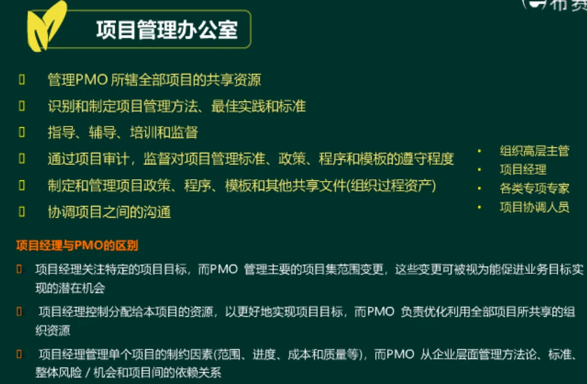

####道德与行为规范
  * 责任：对自己所做的决策或未做决策、所采取的行为或未采取行为、以及相应的后果，承担责任。
  * 尊重：对自己、他人和委托给自己的资源表现出高度的重视，委托的资源包括人员、资金、声望、他人安全，以及自然和环境安全。
  * 公正：客观而无偏见的做出决策和行动。
  * 诚实：了解真相，并且在沟通和行为中以诚实的方式行事。

####我们需要做的
  * 保持个人正直诚信
  * 解决利益冲突
  * 平衡干系人的利益
  * 尊重他们的知识产权
  * 妥善解决文化敏感问题（私底下解决）
  * 对项目管理行业做出贡献

####不找发起人

##项目关联关系
###项目
>项目是为创造独特产品、服务或成果而进行的临时性工作

项目由如下特点
  * 临时性：项目有明确的**起点和终点**。但是项目所创造的产品、服务或成果一般不具有临时性。大多数项目是为了创造持久性的结果。
  * 独特性：每个项目都会创造一个独特的产品、服务或成果。
  * 渐进明细：随着信息越来越详细和估算越来越准确，而持续改进和细化计划。使项目管理团队能随着项目的进展而进行更深入的管理。

####渐进明细VS范围蔓延
  * 范围蔓延是超出承担超出工作职责的事/制作超出产品定义范围的功能。
  * 渐进明细是必须要做的，范围蔓延是必须避免的。

####目标：
  * 成果性目标（项目目标）：通过项目开发出的满足客户需求的产品、服务或成果。
  * 约束性的目标（管理性目标）：完成项目成果性目标所需要的时间、成本以及要满足的质量、范围等。
  * SMART原则。
  * 项目驱动组织进行变更：项目旨在推送组织从一个状态转到另一个状态，从而达成特定目标。
  * 项目创造商业价值：PMI将商业价值定义为从商业运作中获得的可量化净效益，效益可以是有形的、无形的或两者兼有之。

####应对影响组织的因素
这些因素会影响组织的持续运营和业务战略
这些因素最终应与组织的战略目标以及各个项目的商业价值相关联
  * 符合法规、法律或社会要求
  * 满足相关方要求或需求
  * 执行、变更业务或技术战略
  * 创造、改进或修复产品、过程或服务

####项目管理
项目管理的概念
  * 将知识、技能、工具与技术应用于项目活动中，以满足项目的要求。
  * 平衡互相竞争的项目制约因素，包括但不限于范围、质量、进度、预算、资源、风险。
  * 通过合理运用与整合特定项目所需的项目管理过程得以实现。

项目管理的主要工作
  * 通过与项目主要干系人，来识别项目的**要求**
  * 建立明确、具体与现实可行的**项目目标**，把项目目标转化为具体的实施**计划**，组建项目团队具体**实施**。
  * 在分析项目要求基础上，在项目目标之间寻找**最佳平衡点**，在项目干系人之间寻找最佳平衡点
  * 对项目进展情况进行动态**监督与控制，及时纠正偏差**，保证项目顺利运行
  * 对项目阶段或整个项目进行正式**收尾**工作，结束阶段或整个项目。

###项目集
>项目集是一组**相互关联**并且被**协调管理**的项目，子项目集和项目集活动，以便获得分别管理无法获得的利益。项目集中可以包括单个项目范围之外的相关工作

####项目集管理
  * 将知识、技能与原则来实现项目集的目标，获得分别管理项目集组成部分所无法实现的利益和控制项。
  * 重点关注**项目间的依赖关系**，有助于找到管理依赖关系的最佳方法。

项目集管理的主要工作
  * 解决系统中影响多个项目的资源制约和因素
  * 调整对项目和项目集的目的与目标有影响的组织方向和战略方向
  * 处理同一个治理结构内的相关问题和变更管理

项目一共由六大制约因素：范围、质量、进度、预算、资源、风险

###项目组合
>项目组合是为了实现战略目标而组合在一起管理的项目、项目集、子项目集合和**运营工作**

####项目组合管理
  * 为了**实现战略目标**而对一个或多个项目组合进行集中的管理。

项目组合管理主要工作
  * 通过审核项目和项目集来确定资源分配的优先顺序，确保项目组合的管理与组织战略协调一致。
  * 基于风险、资金和其他考虑因素对项目组合组件排列优先级。

项目集和管理|项目组合管理
-|-
以"正确"的方式开展项目集和项目|开展"正确"的项目集和项目

###组织级项目管理（OPM）
  * 实现战略目标而整合项目组合、项目集和项目管理与组织驱动因素的框架。
  * 旨在确保组织开展正确的项目并合适的分配关键资源。OPM有助于确保组织的各个层级都了解组织的战略愿景、支持愿景的举措、目标以及可交付成果。
  * 组织面对激烈变化、严峻挑战的环境，为求得长期生存和不断发展而进行的总体性策划
  * 主要特点有全局性、长远性、抗争性和纲领性

###运营
>运营是通过开展持续的活动来生产同样的产品或提供重复的服务的一种组织职能。
>运营管理关注产品的持续生产和服务的持续运作。

项目与日常运营的共同特征
  * 由人来做
  * 受限于有限的资源
  * 需要规划、执行和控制
  * 为了实现组织的目标或战略计划

项目与日常运用的根本区别
  * 项目的临时的，运营是持续的
  * 运营的目标是为了维持业务的经营
  * 项目的目标是为了达到相应的目标而结束项目

项目与运营交互点
  * 新产品开发、产品升级或提高产量
  * 改进运营或产品开发流程时
  * 产品生命周期结束阶段
  * 收尾阶段

##项目生命周期

  * 阶段之间的关系可以是顺序、迭代或交叠进行。项目生命周期可以是预测型和适应型。
  * 项目生命周期内通常由一个或多个阶段产品、服务或成果的开发相关，这些阶段成为开发生命周期。
  * 开发生命周期可以是预测型、迭代型、增量型、适应型（敏捷管理）或混合型模式。
    * 预测性生命周期：在生命周期早期阶段确定项目范围、时间和成本。也称瀑布型生命周。
    * 迭代型生命周期：项目范围通常于项目生命周期的早起确定，但时间及成本估算将随着项目团队对产品理解不断深入而定期修改。迭代方法即通过一系列重复的循环活动来开发产品，增量方法是渐进的增加产品的功能。
    * 增量型生命周期：在预定时间区间内组件增加产品功能的一系列迭代来产品可交付的成果。只有最后一次迭代之后，可交付成果具备了必须和足够的能力，才被视为完成的。
    * 适应型生命周期：敏捷型、迭代型、增量型。
    * 混合型生命周期：

关于项目的阶段：
  * 一个项目可以划分为任意数量的阶段
  * 项目阶段是一组具有逻辑关系的项目集合，以一个或多个可交付成果的完成为结束。
  * 生命周期的各个阶段可以通过各种不同的属性来描述
    * 名称
    * 数量
    * 持续时间
    * 资源需求
    * 准入标准
    * 退出标准

####阶段关口
在项目阶段结束的时候进行，将项目绩效和进度与项目和业务文件根据比较结果做出决定。
  * 进入下个阶段
  * 整改后进入下个阶段
  * 结束项目
  * 停留在当前阶段
  * 重复阶段或某个要素

####项目管理过程
  * 通过合适的项目管理工具和技术将一个或多个输入转化成一个或多个输出。
  * 各个项目管理过程通过它们所产生的输出建立逻辑联系。过程可能包含了在整个项目期间相互重叠的活动。

####项目管理过程组
>项目管理过程指对项目管理过程进行逻辑分组，以达到特定的目标

  * 启动过程组：定义一个新项目或现有项目的一个新阶段，授权开始该项目或阶段组的一部分
  * 规划过程组：明确项目范围，优化目标，为实现目标制定行动方案的一组过程
  * 执行过程组：完成项目管理计划中确定的工作，以满足项目要求的一组过程
  * 监控过程组：跟踪、审查和调整项目进展与绩效，识别必要的计划变更并启动相应变更的一组过程
  * 收尾过程组：正式完成项目或结束项目、阶段或合同所执行的过程。

####项目数据
  * 工作绩效数据：执行项目工作过程中，每个正在执行的活动中收集到的原始观察结果和测量值。
  * 工作绩效信息：从各控制过程中收集并结合相关背景和跨领域关系，进行整合分析而得到的绩效数据。
  * 工作绩效报告：为制作决策、提出问题、采取行动或引起关注，而汇编工作绩效信息，所形成的实物或电子项目文件。

####项目管理商业文件
  * 项目商业文件：文档化的经济可行性报告，用来对缺乏充分定义的所选方案收益进行有效性论证，是启动后续项目管理活动的依据。
  * 项目效益管理计划：描述了实现收益的方式和时间，以及应制定和效益（发起组织和项目受益方创造价值的行动、行为、产品服务或成果的结果）衡量机制。
  * 项目章程：项目发起人发布，正式批准项目成立，授权项目经理动用组织资源开展项目活动的文件。
  * 项目管理计划：如何执行、监督和控制项目的一份文件。
  * 项目成功标准：是否达到目标，是否让客户满意

##项目运营环境

####事业环境因素
>是很多项目管理过程，尤其是大多数规划过程的输入。

事业环境因素的特点
  * 客观存在的
  * 可呢由帮助或由阻碍
  * 项目经济必须遵守

内部事业环境因素的例子
  * 组织文化、结构和流程
  * 设施和资源的分布
  * 信息技术软件
  * 资源可用性
  * 员工能力
  * 基础设施

外部事业环境因素的例子
  * 市场条件
  * 法律限制
  * 学术研究
  * 商业数据库
  * 物理和环境因素
  * 政府或行业标准
  * 社会和文化影响

####组织过程资产
>能够在未来带来效益的东西，如执行组织所特有的使用的计划、过程、政策、程序知识库。

组织过程资产的特点
  * 可累加的（可更新与增补）
  * 对未来有帮助的
  * 可选择使用（可裁剪）

例子：
  * 指南和标准
  * 特定的组织标准（政策）
  * 产品和项目生命周期，以及方法和程序（管理方法、评估指标、过程审计、改进目标、核对单、组织内使用的标准化的过程定义）
  * 模版（项目计划、报告格式）
  * 各种合同协议类型
  * 变更控制程序，修改组织标准、政策、计划和程序所必须遵守的步骤以及如何批准和确认变更（有变更，走流程）
  * 跟踪矩阵
  * 财务控制程序（人工时，实际成本、预算）
  * 问题与缺陷管理程序
  * 项目收尾指南或要求（项目终期审计、项目评价、产品确认以及验收标准）
  * 配置管理知识库（版本管理）
  * 历史信息与经验教训知识库（问题整理）
  * 问题缺陷管理数据库
  * 测量指标数据库，用来收集和提供过程和产品的测量数据
  * 以往的项目档案

####组织系统
>单个组织多种因素交互影响创造出一个独特的系统，会对系统内运行的项目造成影响。决定了内部人员的权利、影响力、利益、能力和政治能力。

组织系统包括：
  * 治理框架
  * 管理要素
  * 组织结构类型

系统的原则：
  * 系统是动态的
  * 系统可以优化
  * 系统组件可以优化
  * 系统及其组件不能同时优化
  * 系统呈现非线性响应（输入的变更并不会产生可预测的输出）

####组织治理框架
治理是指组织各个层面有组织或有结构的安排，旨在确定和影响组织成员的行为。
治理框架是在组织内行使职权的框架，包括规则、政策、程序、规范、关系、过程、系统。
  * 影响组织目标设定和实现方法
  * 风险监控和评估方式
  * 绩效优化方式

常见的治理领域：
  * 一致性
  * 风险
  * 绩效
  * 沟通

各个领域都具备以下的职能部门
  * 监督
  * 控制
  * 整合
  * 决策

项目治理是用于指导项目管理活动的框架、功能和过程，从而创造独特的产品、服务或成果以满足组织、战略和运营目标。

####管理要素
>组织内部的关键职能部门和一般管理原则的组成部分

  * 基于专业专业技能和可用性开展工作的部门；组织授予工作职权
  * 工作职责，开展组织根据技能和经验等属性合理分派任务
  * 具有纪律的行为
  * 统一指挥原则，一个员工只接受一个上级的指示
  * 统一领导原则，只有一个领导
  * 组织总体目标优先于个人目标；支付合理的薪酬；资源的优化使用
  * 畅通的沟通渠道；正确的时间让正确的人使用正确的材料做正确的事
  * 公正、公平的对待所有员工；明确岗位的安全职责；确保员工安全
  * 允许任何员工参与计划和实施；保持员工士气

##组织
####职能型组织

####项目型组织

####矩阵型
矩阵型特点是有两个BOSS

####项目管理办公室（PMO）
>对项目相关治理过程进行标准化，促进资源、方法论、工具和技术共享的一个组织结构

主要类型有：
  * 支持型：担当顾问角色，类似一个项目资源库
  * 控制型：不仅提供支持，而且通过各种手段要求项目服从
    * 采用项目管理框架或方法论
    * 使用特定的模版、格式和工具
    * 服从治理
  * 指令型：直接管理和控制项目，项目由PMO制定并向其报告

PMO只要职能是通过各种方式给项目经理提供支持
  * 对PMO管辖的全部的共享资源进行管理
  * 识别和制定项目管理方法、最佳实践和标准
  * 指导、辅导、培训和监督
  * 通过项目审计，监督对项目管理标准、政策、程序和模版的遵守程度
  * 制定和管理项目政策、程序、模版和其他共享的文件
  * 对跨项目进行沟通和协调

项目经理和PMO的区别
  * 项目经理关注特点的项目目标，PMO管理主要的项目集范围变更（促进业务目标实现的潜在机会）
  * 项目经理控制分配给本项目的资源，以便更好的实现目标。PMO负责利用优化全部项目资源共享的组织资源
  * 项目经理管理单个项目的制约因素（范围、时间、进度）。PMO从企业层面管理方法论、标准、整体风险/机会和项目间的依赖关系

##项目经理

  * 成员与角色：
  * 团队中的职责：从整体的角度来看待产品、以便进行规划、协调和完成。
  * 知识和技能：项目管理知识、技术知识、理解和经验。项目技能通过沟通领导团队进行规划和协调

###项目经理影响力

####项目层面

  * 通过多种方法培养完善的技能
  * 创建、维护和遵循沟通计划和进度计划
  * 不断地以可以预见的方式进行沟通
  * 寻求了解项目相关方的沟通需求
  * 以简练、清晰、完整、简单、相关和经过裁剪的方式进行沟通
  * 包含重要的正面和负面消息
  * 合并反馈渠道
  * 人际关系技能，通过项目经理的影响力拓展广泛的人际网络。

####组织层面

  * 项目经理可以致力于提高自己在组织内的总体项目管理能力和技能，并参与隐形和显性知识的转移或整合计划。
  * 展现项目管理的价值
  * 提高组织对项目管理的接受度
  * 提高组内现有PMO的效率

####行业层面

  * 产品和技术开发
  * 新且变化的市场空间
  * 标准
  * 技术支持工具
  * 影响当前项目的经济力量
  * 影响项目管理学科的影响力
  * 过程改进和可持续发展战略

####专业学科层面

  * 在当地、全国和全球层面向其他专业人员分享知识和专业技能
  * 参与培训、继续教育和发展：
    * 项目管理专业
    * 相关专业
    * 其他专业

####跨领域层面

###项目经理的能力

三种技能
  * 技术项目管理：与项目、项目集和项目组合管理特定领域相关知识、技能和行为。
  * 领导力：指导、激励和带领团队所需知识、技能和行为，可帮助组织达成业务目标
  * 战略和商业管理技能：关于行业和组织的知识和专业技能，有助于提高成绩并取得更好的业务成果

##项目管理过程及过程组
过程：为了创建预定的产品、成果或服务而执行的一系列相互关联的行动和活动。每个过程都有各自的输入、工具和技术以及相应的输出。

####五大过程组
启动过程组：定义一个新项目或现有项目的一个新阶段，授权开始该项目或阶段的一组过程。
规划过程组：明确项目全部范围、定义和优化目标，并为实现目标制定行动方案的一组过程。
执行过程组：完成项目管理计划中确定的工作，以满足项目要求的一组过程。
监控过程组：跟踪、审查和调整项目进展与绩效，识别必要的计划变更并启动相应变更的一组过程。
收尾过程组：为正式完成或关闭项目、阶段或合同开展的过程。

  * 五大过程组有清晰的相互依赖关系，每个项目上一般都按照同样的顺序进行。
  * 在项目完成之前，需要反复实施各个过程组所含过程。各过程可能在同一过程组内跨越不同过程组相互作用。
  * 一个过程组包含若干个项目管理过程，在整个项目期间重叠。一个过程的输出通常为另一个过程的输入，或者成为项目的可交付结果。
  * 以启动过程组开始项目，以收尾过程组结束项目。

####启动过程组

####规划过程组

####执行过程组

####监控过程组

####收尾过程组

