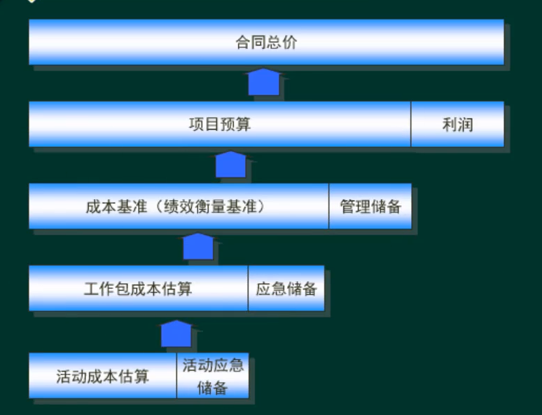

#项目成本管理

##成本管理包含过程

####成本类型
  * 直接成本：项目经理可以直接把控，例如：团队人员工资
  * 间接成本：项目经理无法直接控制，例如：行政/人事/水电
  * 机会成本：做A放弃B，此时B就是A的机会成本。反之亦然。

####成本管理概念
  * 应急储备：已知-未知风险（包含在成本基准里面，PM可以自己用）
  * 管理储备：未知-未知风险（不包含在成本基准里面，需要去管理层申请）

##规划成本管理

##估算成本

##制定预算
  * 预算比成本更加**准确**

##控制成本

  * 监督项目状态，更新项目成本和管理成本基准变更的过程，在整个项目期间保持对成本基准的维护。本过程在整个项目期间开展。

####挣值分析
  * 计划价值：Plan Value(PV)
  * 挣值：Earned Value(EV)
  * 进度偏差：Schedule Variance(SV)
  * 进度绩效指数：Schedule Performance Index(SPI)
  * 实际成本：Actual Duartion(AC)
  * 成本偏差：Cost Variance(CV)
  * 完工估算：budget at Completion(BAC)
  * 完工预算：Estimate to Completion(EAC)
  * 完工偏差：Variance at Completion(VAC)
  * 完工尚需预算：Estimate to Complete(ETC)
  * 完工尚需绩效指数：To-Completion Performance Index(TCPI)

