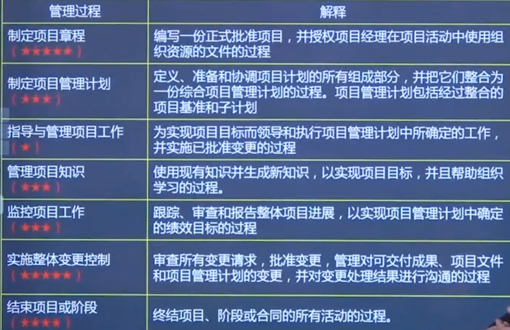
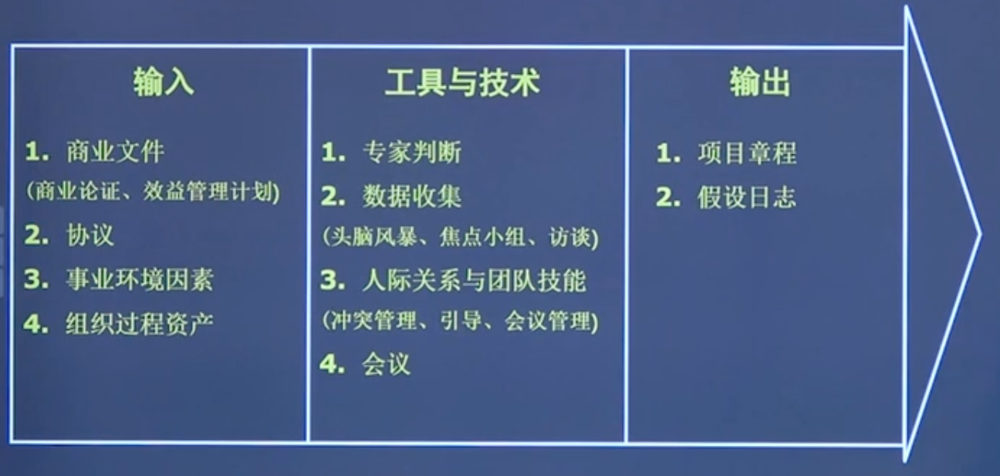
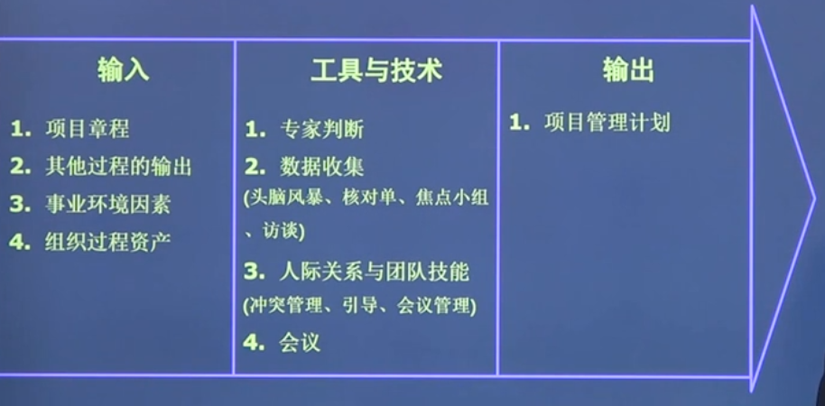
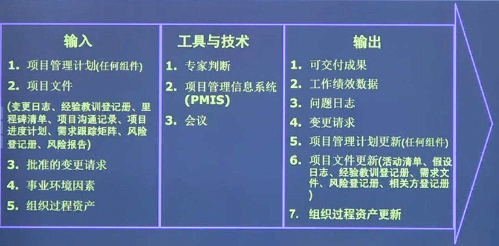
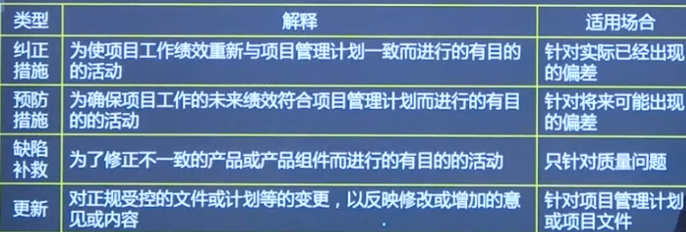
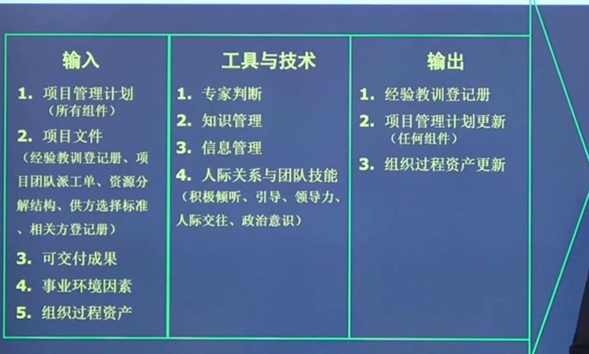
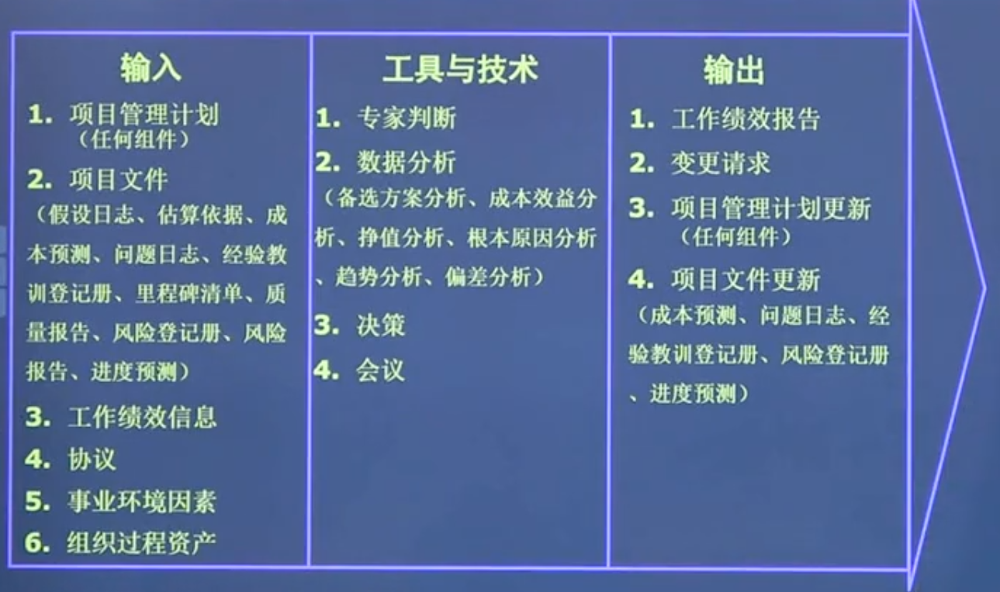
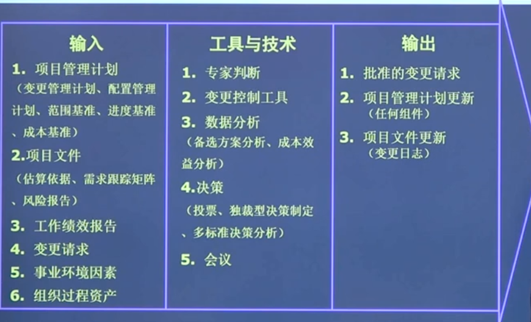
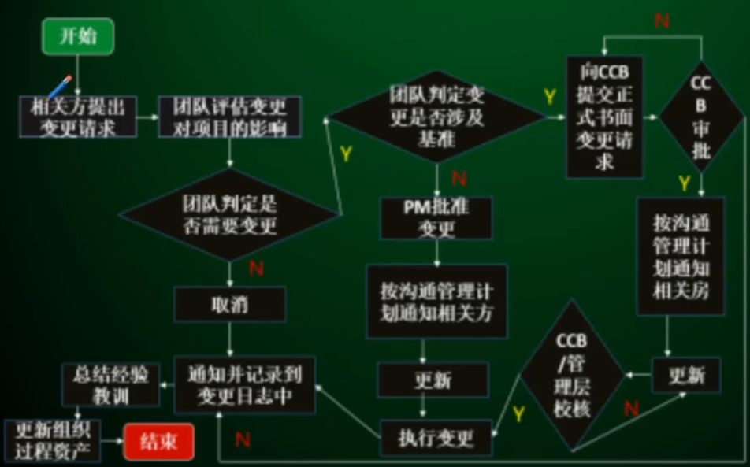
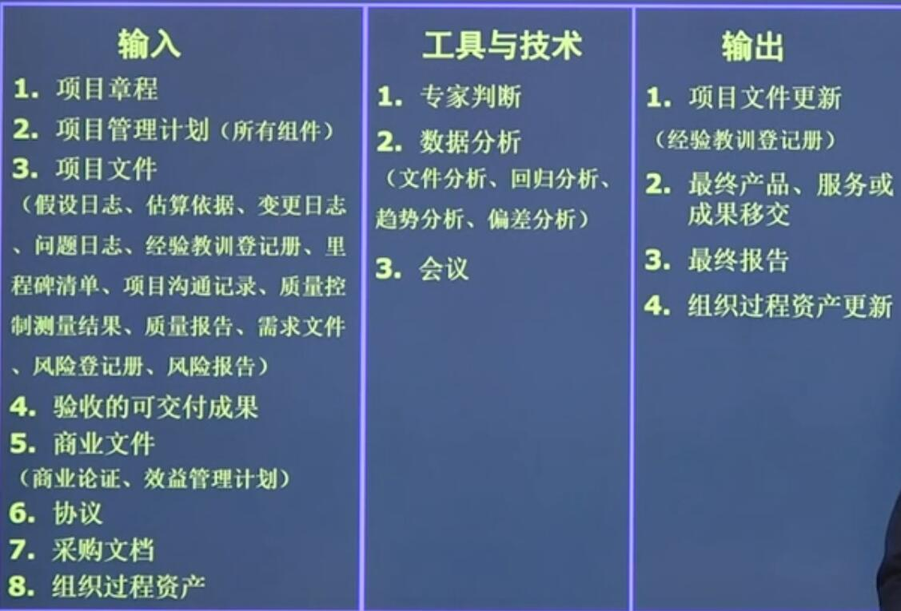

#项目整合管理
>项目整合管理由项目经理负责，项目经理必须对整个项目承担最终责任

整合所有其他知识领域的成果，并掌握项目总体情况
  * 确保产品、服务或成果的交付日期，项目生命周期以及效益管理计划这些方面保持一致。
  * 编制项目管理计划以实现项目目标
  * 确保创造合适的知识并运用到项目中，并从项目中获取必要的知识
  * 管理项目管理计划中活动的绩效和变更
  * 做出针对影响项目的关键变更的综合决策
  * 测量和监督项目进展，并采取适当措施以实现项目目标
  * 收集关于已达成结果的数据，分析数据以获取信息，并与相关方分享信息
  * 完成全部项目工作，正式关闭各个阶段、合同以及整个项目
  * 管理可能需要的阶段过渡

####整合管理的概念
>项目整合管理包括对隶属于项目管理过程组的各个过程和项目管理活动进行识别、定义、组合、统一和协调的各个过程

  * 项目整合管理过程负责项目的全生命周期管理、全局性管理和综合性管理
    * 全生命周期管理：从启动阶段到收尾阶段的整个项目生命周期
    * 全局性管理：管理工作、技术工作和商务工作
    * 综合性管理：管理项目的需求、范围、进度、成本、质量、人力资源、沟通、风险和采购
  * 项目经理是重要角色的整合者。通过协调实现整合，通过沟通实现协调
  * 项目启动通常由项目团队之外的人进行
  * **项目监控工作的一项重要输出是变更请求**，需要根据绩效报告来提出变更请求。变更请求也可以在执行过程中提出
  * 所有变更都需要经过整体变更控制过程的综合评审，但**不是所有变更都需要提交给CCB**
  * 一般的变更控制系统针对项目绩效基准（范围、时间和成本），而配置变更系统主要针对项目的技术参数（配置）

####制定项目章程
>编写一份正式**批准项目**并**授权项目经理**在项目活动中使用组织资源的文件的过程。

项目章程由管理层签发，项目经理是项目章程的执行者（需要参与项目章程的制定）。
项目章程所规定的是一些比较大的，原则性的问题，通常不会因为项目变更而需要对项目章程做出修改
只有管理层（审批人）才有资格对项目章程做出修改
项目章程的作用
  * 正式宣布项目的存在,赋予项目合法的地位
  * 对项目目标、范围、主要可交付成果、主要制约因素与假设条件进行总体性描述
  * 正式任命项目经理，授权其使用组织资源开展项目活动
  * 通过叙述项目的理由，把项目与组织战略及日常运营工作联系起来
  * 使项目团队对项目有一个整体的了解，并成为项目团队共同遵守的行为规则，减少项目实施过程中出现的问题。

####制定项目管理计划
>定义、准备和协调项目计划的所有组成部分，并把他们整合为一份综合项目管理计划的过程。项目管理计划包括整合的项目基准和子计划。

  * 定义了完成项目所需要的工作和完成这些工作的方法
  * 项目管理计划是一个动态的文档，随着时间和工作的进行，项目管理计划会越来越精确。
  * 定义和分配资源
  * 建立在给定的数据上。
  * 项目管理计划是灵活的，可以根据需要进行适当的裁剪。
  * 规划是一个有竞争力的工程师同样应该具有的能力。
  * 一般是**项目经理**来制定

####项目管理计划
作用：
  * 指导项目执行、监控和收尾
  * 为绩效考核和项目控制提供基准
  * 记录项目计划编制所依据的假设条件
  * 记录项目计划编制过程中的有关方选择
  * 促进项目相关方之间的沟通
  * 规定管理层审查项目的时间、内容和方式

####基准
>基准是经过批准的项目计划加上或减去经过批准的变更，以此作为基础，考核项目执行情况的好坏，确定实际绩效在是否可接受的偏差范围内。

  * 基准是经过高级管理层和主要相关方批准的。
  * 基准是最新版本的项目计划
  * 只有高层（控制委员会）才有权利批准进行基准的变更，项目经理无权批准
  * 常见的基准包括
    * 范围基准
    * 进度基准
    * 成本绩效基准
    * 技术基准
    * 综合性的绩效测量基准

####制约因素和假设条件

制约因素：限制项目团队的选择余地的因素，常见有范围、时间、成本、质量、人力资源。
项目经理必须在制约因素的限制下，进行项目的规划、执行、监控和收尾工作。

假设条件：编制项目计划所依据的、假设为“真实”或“确定”的一些条件，是项目计划的重要基础

####总结
  * 项目管理计划是一个综合性的计划。
  * 编制项目管理计划要持续要项目收尾，是渐进明细出来的。
  * 一旦确定下来，成为基准，只有在提出变更请求并经实施整体变更控制过程批准后，才能变更。
  * 项目管理计划需要包括依据的基本资料
  * 项目管理计划必须是自下而上编制出来的。

##指导与管理项目工作

  * 开展活动以实现项目要求
  * 创造项目的可交付成果，完成规划的项目工作
  * 配备、培训和管理项目团队成员
  * 获取、管理和使用资源。包括材料、工具、设备和设施
  * 执行已经好的方法和标准
  * 建立并管理项目团队内外的项目沟通渠道
  * 生成工作绩效数据，为预测提供基础
  * 提出变更请求，根据实施情况实施批准变更
  * 管理风险并实施风险应对活动
  * 管理卖方和供应商
  * 管理相关方及他们在项目中的参与
  * 收集和记录经验教训，实施批准的过程改进活动

####变更请求
  * 批准的变更请求应列入计划，以便由团队加以实施
  * 批准的变更请求书面记录了经过批准的变更

####开工会议

  * 项目执行阶段开始的标志
  * 项目计划编制 工作结束、执行工作开始时由项目的主要相关方联合召开的会议
  * 加强沟通与协调，保证各方了解项目计划和项目的主要工作人员。

####项目管理信息系统
  * 进度计划软件工具
  * 工作授权系统
  * 配置管理系统
  * 信息收集与发布系统
  * 各种自动化系统

####工作授权系统
  * 目的：确保工作以正确的组织，正确的时间、正确的顺序完成。
  * 时间：项目管理计划完成之后进行。
  * 进度计划工作需要得到授权才可开始
  * 防止镀金行为和防止增加额外的功能

####管理项目知识
>使用现有知识，生成新的知识，以实现目标，并帮助组织学习的过程。

  * 利用现有知识来来创造或者改进成果，用于支持组织运营和未来的项目。
  * 能够在项目开展之前、开展期间和结束之后得到应用

####经验教训登记册
  * 包含以下部分
    * 情况的类别和描述
    * 情况有关的影响、建议和行动方案
    * 遇到的挑战、问题
    * 意识到的风险和机会
  * 在早起创建，作为管理项目知识的输出。
  * 在项目结束阶段，会把相关信息归入经验教训知识库，成为组织资产的一部分。
  * 所有的项目都会生成新知识，有些知识会被编撰，并在管理项目知识过程中嵌入可交付成果，用于改进过程和程序。

####监控项目工作
>跟踪、审查和报告整体项目进展，以实现项目管理计划中确定的绩效目标过程。

  * `监督`：收集、测量和分析测量结果，以及预测趋势，以便推动过程改进。持续的监督使项目团队能够洞察项目的健康状况，并识别须特别关注的的任何方面。
  * `控制`：制定纠正或预防措施或重新规划，并跟踪行动计划的实施过程，以确保它们能有效解决问题
  * `监控`：让相关方了解项目的当且状态并认可为处理绩效问题而采取的行动，通过成本和进度预测，让相关方了解未来项目状态。
  * 监控过程贯穿项目工作的始终。
  * 主要手段是通过在预定的里程碑处，将实际的工作产品和任务属性、工作量、成本，以及进度与计划进行对比来确定进展情况。
  * 适当的可视性使得项目与计划发生重要的偏差（不解决就会妨碍项目达成目的偏差）时能够及时采取纠正措施。

监控主要的活动：
  * 把项目的实际绩效和项目管理计划进行比较
  * 定期评估项目绩效，决定是否采取纠正或预防措施，并推荐必要的措施。
  * 检查单个项目的风险状态，识别新风险，分析、跟踪和监测已有风险，确保全面识别风险、报告风险状态
  * 维护一个准确且及时更新的信息库，反映项目产品及相关文件的情况
  * 为状态报告、进展测量和预测提供信息；
  * 监督以批准变更的实施情况。
  * 向项目集管理层报告项目进展和状态；
  * 项目和商业需求保持一致
  * 评估项目绩效，决定是否需要采取纠正或预防措施，并推荐必要的措施
  * 在已批准的变更实际发生时，监督实施情况。

####变更控制
>审查所有变更请求，批准变更，管理对可交付成果、项目文件和项目管理计划的变更，并对变更处理结果进行沟通的过程，该过程贯穿项目始终。

  * 审查所有变更请求，批准变更，管理可交付成果、项目文件和项目管理计划的变更，并对处理结果进行沟通的过程。
  * 实施整体变更控制过程贯穿项目始终。
  * 项目的任何相关方都可以提出变更请求。所有变更请求都必须以**书面形式记录**，纳入变更管理/配置管理系统中。
  * 变更请求由变更控制系统和配置控制系统中所列的过程进行处理，可能需要向这些过程说明变更对时间和成本的影响。
  * 对于变更请求的分析和审查必须是综合的、全面的，必须考察每个变更可能给项目各方面带来的影响，而不仅仅是考察一两个方面。
    * 范围变更控制
    * 进度变更控制
    * 质量变更控制
    * 成本变更控制
    * 风险监督与控制
    * 合同变更控制

主要活动：
  * 审查所有针对项目文件、可交付成果、基准或项目管理计划的变更请求，批准或否决这些变更。
  * 规避整体变更控制的因素施加影响，确保只有经批准的变更才能付诸执行。
  * 迅速地审查、分析和批准变更请求。
  * 管理已批准的变更。
  * 仅允许经批准的变更纳入项目管理计划和项目文件中，维护基准的严肃性。
  * 审查已推荐的全部纠正措施和预防措施，并加以批准或否决。
  * 协调整个项目中的各种变更。
  * 完成记录变更请求的影响。

引起变更的原因
  * 产品范围（成果）定义过失或疏忽【纠错变更】
  * 项目范围（工作）定义过失或疏忽【纠错变更】
  * 项目执行过程与项目基准要求不一致带来的被动变更【纠错变更】
  * 应对风险的紧急计划或回避计划【适应外界变化】
  * 外部事件【适应外界变化】
  * 增值变更【提高性价比】

####有变更走流程
>整套变更请求需要记录

  * 提出变更请求
    * 接收变更申请
    * 识别变更
    * 评价变更对项目的影响
    * 寻找处理变更的备选方案
    * 征求项目相关方的意见
  * 批准或否决变更
  * 实施变更
  * 追踪变更的实施情况
  * 存档

批准变更的权限
  * 任何人都可以提出变更
  * 项目章程只有签署或批准该章程的人才有权利批准，而项目经理只能提出建议
  * 如果变更是项目计划内的，或者通过赶工或快速跟进来解决变更带来的负面影响，那么项目经理有权做出决定。
  * 如果变更影响到范围、时间、成本和质量目标，即导致项目基准的变化，只有CCB才有权利批准。项目经理可以分析并提出意见。**这些变更不一定影响到项目章程**
  * 在紧急情况下的任何变更，项目经理都有权限批准实施，事后补办手续。
  * 如果由合同，那么还需要经过客户的批准
  * 不是所有的变更都需要通过变更控制系统审批。

变更控制系统
  * 关于变更管理的一系列正式的书面程序，包括文档、跟踪系统和变更的批准层次。
  * 需要说明各个相关方的权利与责任
  * 需要说明什么样的变更需要哪个层次的变更，也说明在什么情况下可以不经批准就实施变更。

####整体变更控制流程

  * 批准后，先沟通相关方，在更新管理计划，最后开始执行，执行完成后继续更新管理计划

####结束项目或阶段
>终结项目、阶段或合同的

主要作用：
  * 存档项目或阶段信息
  * 完成计划的工作（比对）
  * 释放组织团队以开展新工作

主要工作：
  * 达到阶段完工或退出标准所必需的行动和活动
  * 向下个阶段或向生产和运营部门移交项目产品、服务或成果，所必须的行动和活动
  * 收集项目或阶段记录、审核项目成败、收集经验教训和存档项目信息
  * 关闭项目合同协议或项目阶段合同协议
  * 测量相关方满意度

其他注意：
  * 项目必须经过一个正式的收尾过程，对项目"关门"，才算真正结束.
  * 项目发起人或客户对项目产品、服务或成果的最终验收，这是形式上的验收，并非实质性技术验收，是一个必须的程序。真正的技术验收在确认范围中完成。
  * 如果提前终止，也需要结束项目的流程，同时需要调查和记录提前终止的原因。

####行政收尾
行政收尾是为了项目和项目管理工作有一个正规的结束，收集、整理、分发和归档各种项目资料，以便正式确认项目产品的合格性，总结经验教训，更新组织过程资产。
行政收尾的时间：项目结束时、项目提前终止时、项目每个阶段结束时。

主要工作：
  * 产品核实：确认全部工作按要求完成，项目产品符合既定的要求
  * 财政收尾：支付项目款项，完成财务结算
  * 更新项目记录：完成最终项目绩效报告和项目团队成员的业绩记录
  * 总结经验教训，进行项目完工后评价
  * 进行组织过程资产更新。收集、整理和归档各种项目资料
  * 结束项目相关方在项目上的关系，解散项目团队。

####合同收尾
合同结尾属于采购过程，指的结束合同工作，进行采购审计，结束当事人之间的合同关系，并将有关资料收集归档。

和行政收尾的区别：
  * 行政收尾针对项目和项目各阶段。合同收尾针对的合同。
  * 合同收尾发生在行政收尾前，先进行采购审计和合同收尾，然后进行行政收尾。
  * 行政收尾由项目发球人和高层给项目经理签发项目阶段结束或项目整体结尾的书面确认。合同收尾由买方的采购管理员向卖方签发结束的书面确认。

项目收尾的活动：
  * 产品核实
  * 正式验收
  * 收集记录
  * 更新记录
  * 记录存档
  * 归档
  * 经验教训
  * 绩效考评
  * 团队庆祝活动
  * 释放资源