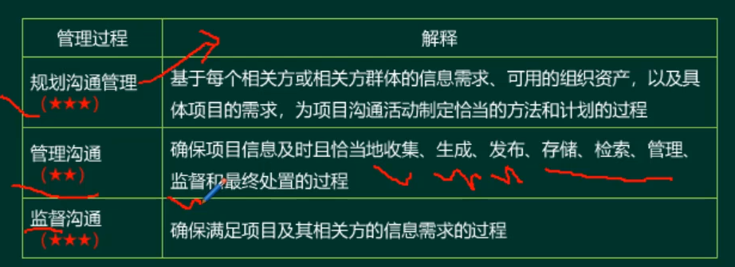
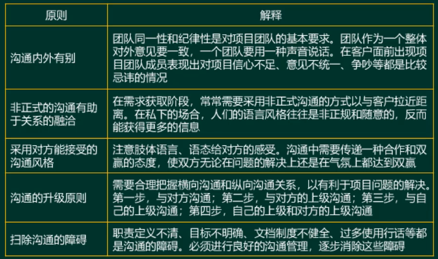
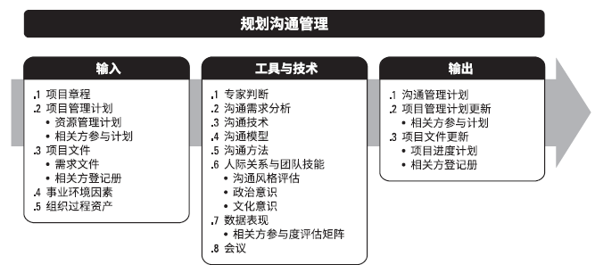
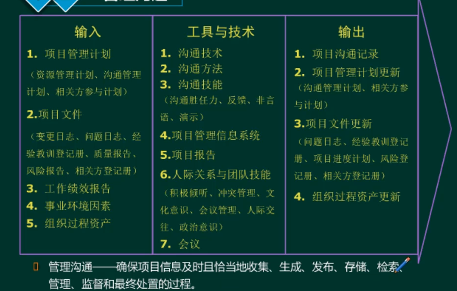
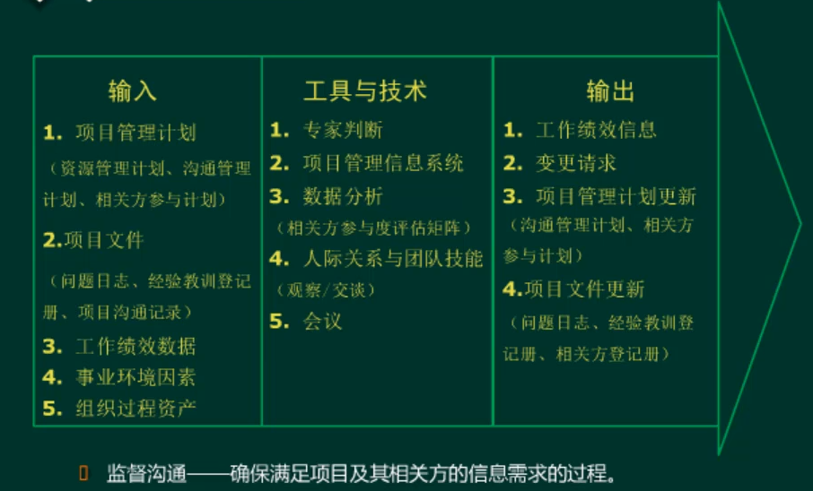

#项目沟通管理

##沟通管理过程

##沟通基本原则

##规划沟通管理
  * 规划沟通管理是基于每个相关方或相关方群体的信息需求、可用的组织资产，以及具体项目的需求，为项目沟通活动制定恰当的方法和计划的过程。本过程的主要作用是，为及时向相关方提供相关信息，引导相关方有效参与项目，而编制书面沟通计划

##管理沟通

####沟通方式
  * 拉式沟通：适用于大量复杂信息或大量信息受众的情况。它要求接收方在遵守有关安全规定的前提之下自行访问相关内容。这种方法包括门户网站、企业内网、电子在线课程、经验教训数据库或知识库。
  * 推式沟通：向需要接收信息的特定接收方发送或发布信息。这种方法可以确保信息的发送，但不能确保信息送达目标受众或被目标受众理解。在推式沟通中，可以采用的沟通工件包括信件、备忘录、报告、电子邮件、传真、语音邮件、博客、新闻稿。
  * 互动沟通：在两方或多方之间进行的实时多向信息交换。它使用诸如会议、电话、即时信息、社交媒体和视频会议等沟通工件。

##监督沟通

