#项目质量管理

####前期思想

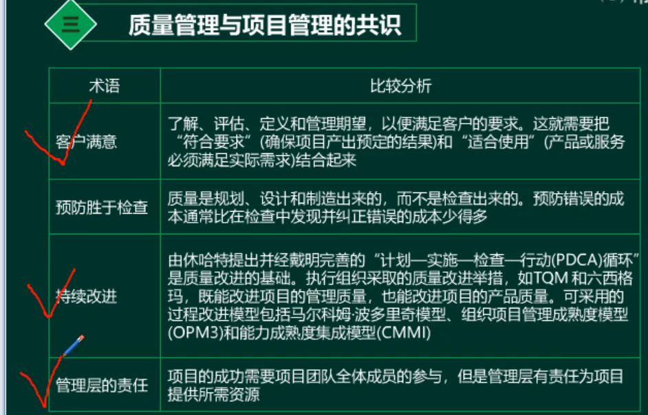

##质量管理理论
####戴明理论

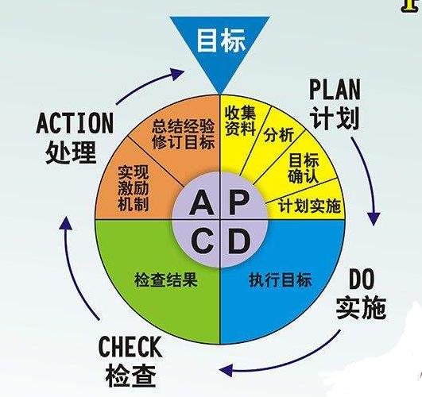

####朱兰理论

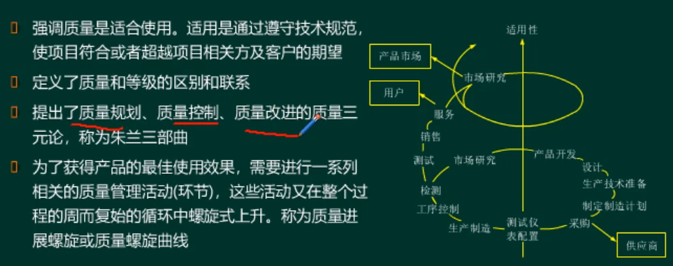

####克鲁斯比理论

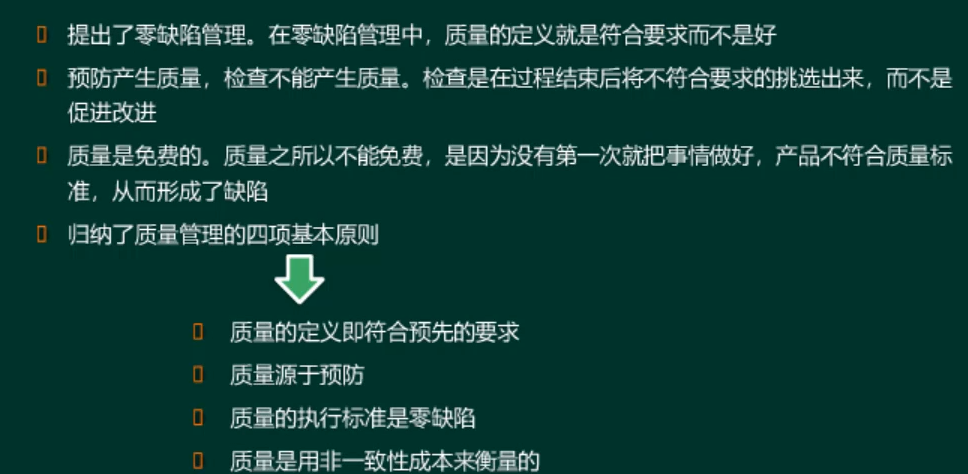

####石川理论
不断问原因是什么

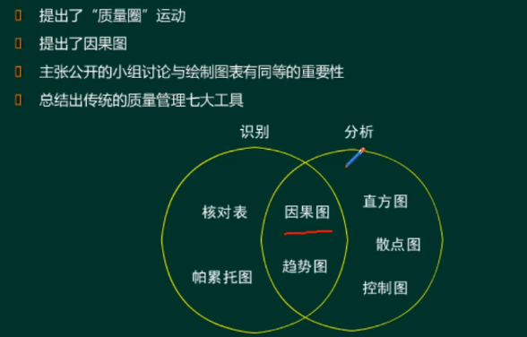

####六西格玛管理

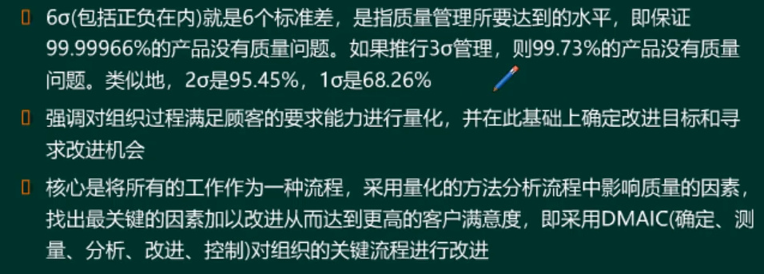

##管理工具
####因果图（石川图）
有助于识别问题的**根本原因或者主要原因**

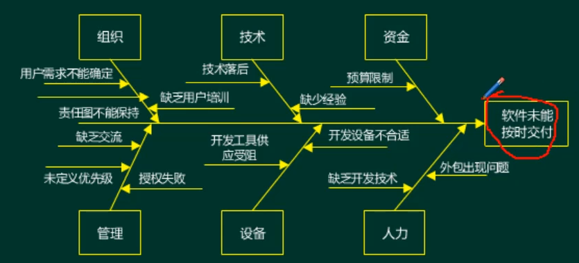

####帕累托图
显示没中已识别的原因导致多少缺陷，排序的目的是重点的采取纠正措施，需要首先处理导致最多缺陷的原因。
相对少量的原因通常会造成大多数问题的缺陷（80%的问题是由20%的原因导致的）。

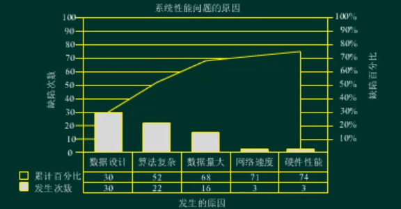

####流程图
展示了引发缺陷的一系列步骤和过程中各个步骤之间的关系。

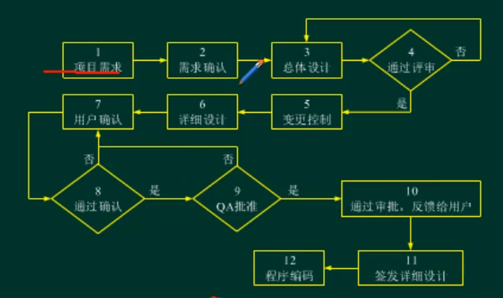

####直方图
把数字的东西以图形的形式展示，主要是**直观**，汇报时使用。

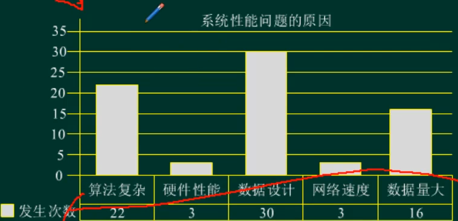

####散点图
展示两个变量之间的关系

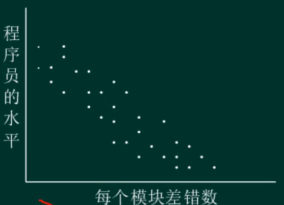

##质量管理过程

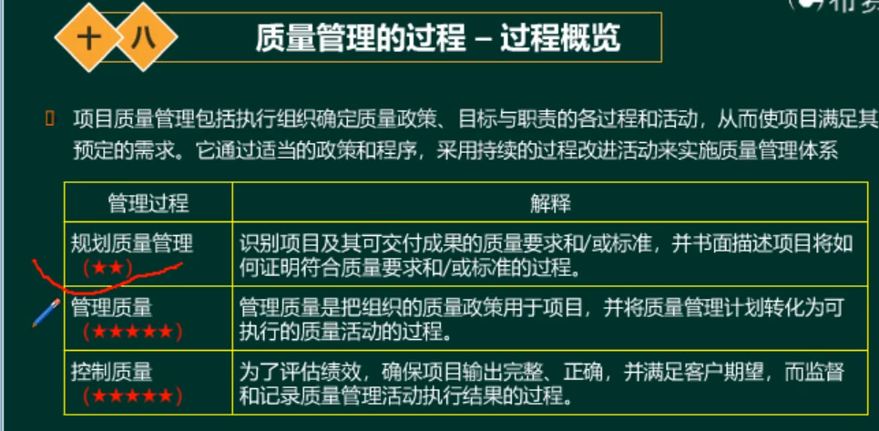

####管理计划
  * JIT：just in time，零库存管理

##规划质量管理

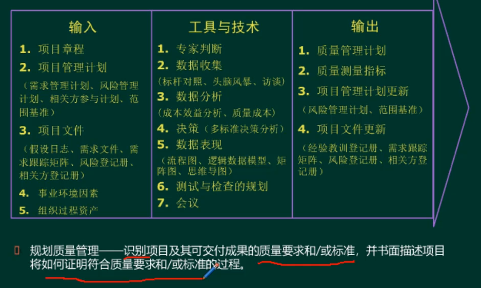

####质量成本

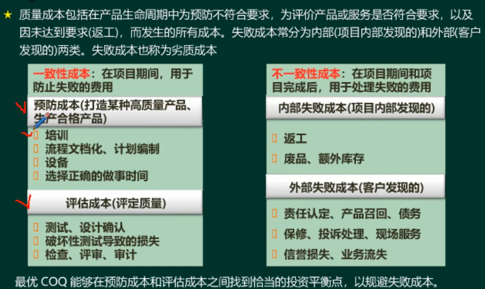

####控制质量

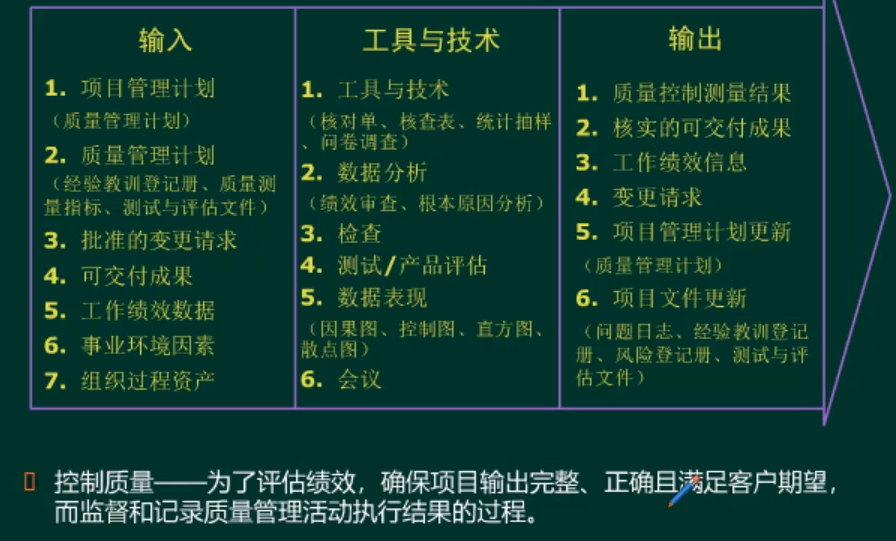

