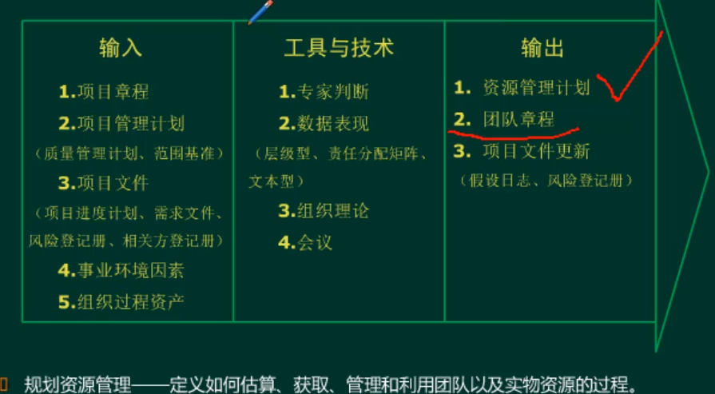
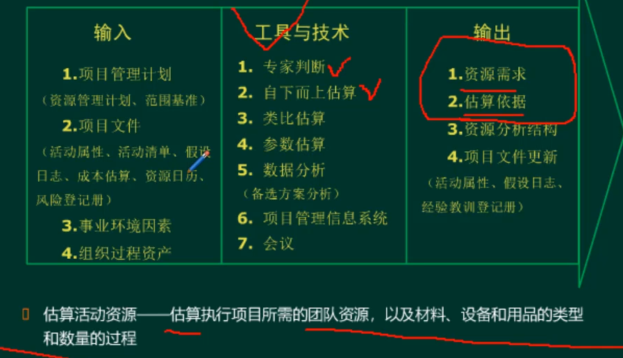
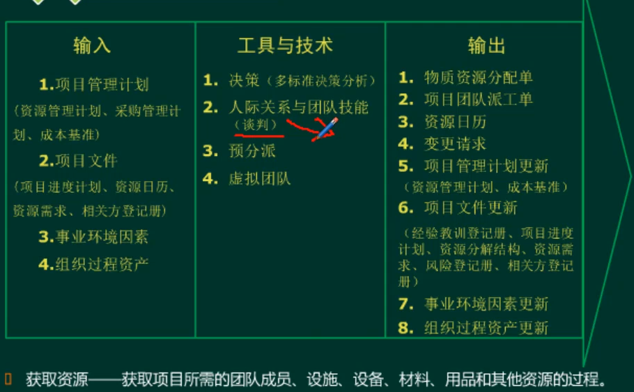
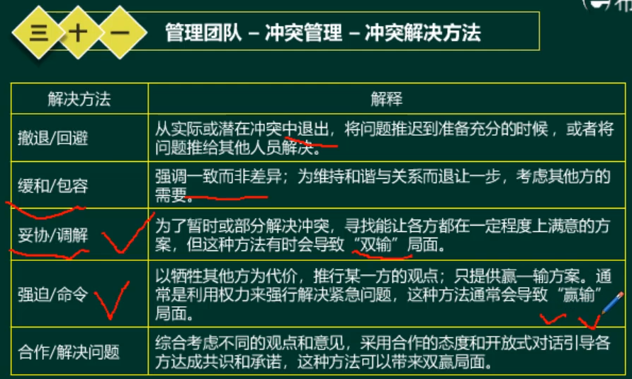

#项目资源管理

##资源管理过程

##规划资源管理

##估算活动资源

##获取资源

##建设团队

####于团队发展的模型（塔克曼阶梯理论）
  * 形成阶段：团队成员相互认识，并了解项目情况及他们在项目中的正式角色与职责。在这一阶段，团队成员倾向于相互独立，不一定开诚布公。
  * 震荡阶段：在本阶段，团队开始从事项目工作、制定技术决策和讨论项目管理方法。如果团队成员不能用合作和开放的态度对待不同观点和意见，团队环境可能变得事与愿违。
  * 规范阶段：在规范阶段，团队成员开始协同工作，并调整各自的工作习惯和行为来支持团队，团队成员会学习相互信任。
  * 成熟阶段：进入这一阶段后，团队就像一个组织有序的单位那样工作，团队成员之间相互依靠，平稳高效地解决问题。
  * 解散阶段：在解散阶段，团队完成所有工作，团队成员离开项目。通常在项目可交付成果完成之后，或者，在结束项目或阶段过程中，释放人员，解散团队。

##管理团队

##控制资源

