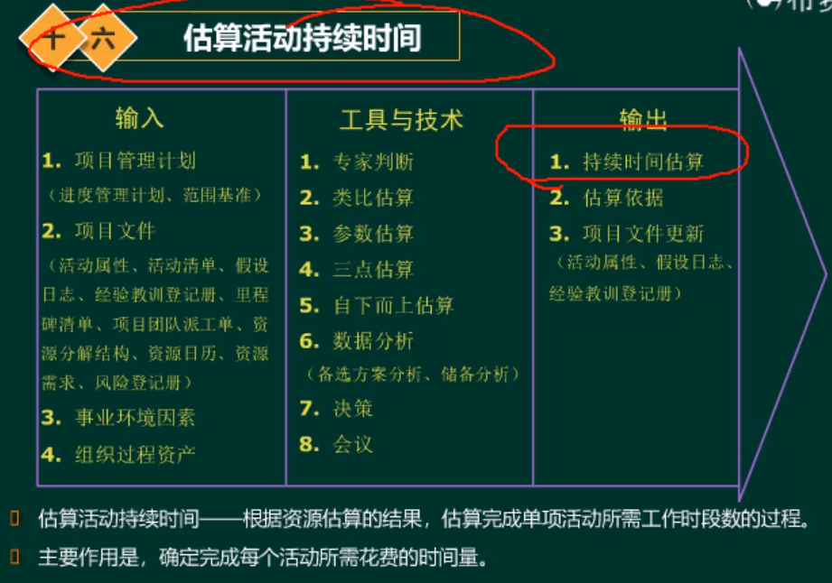
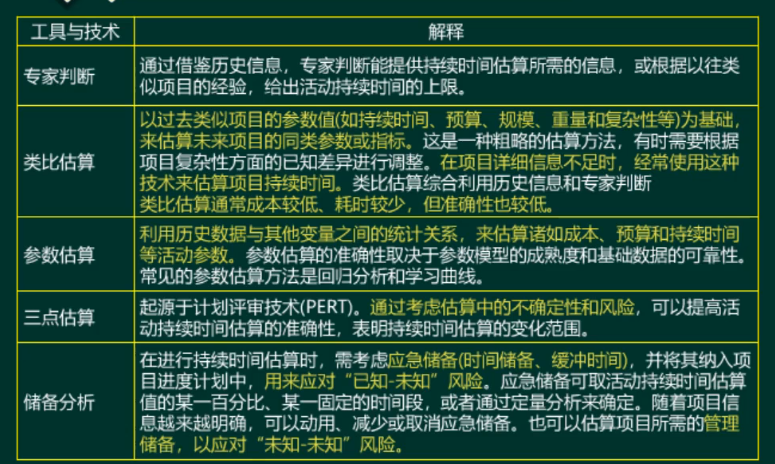
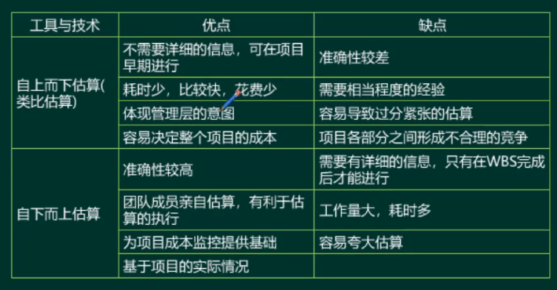
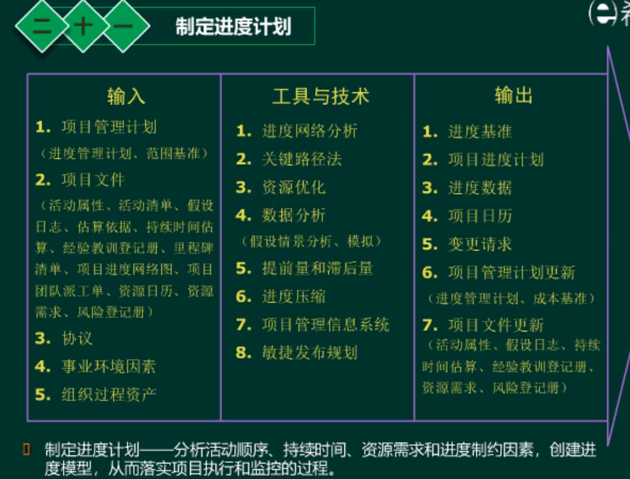
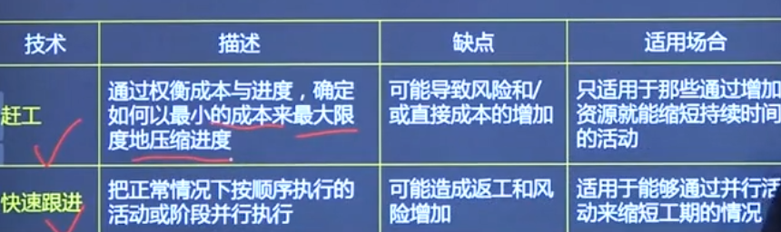
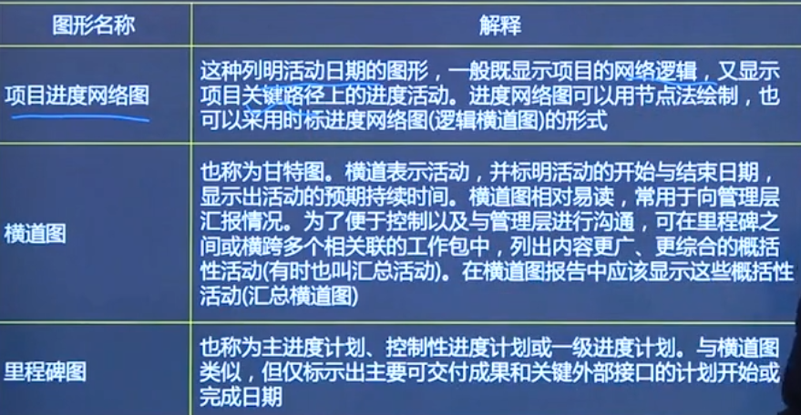
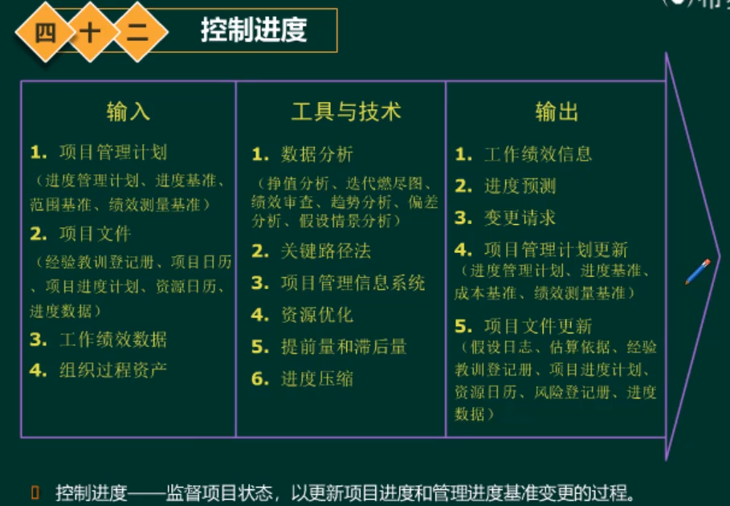
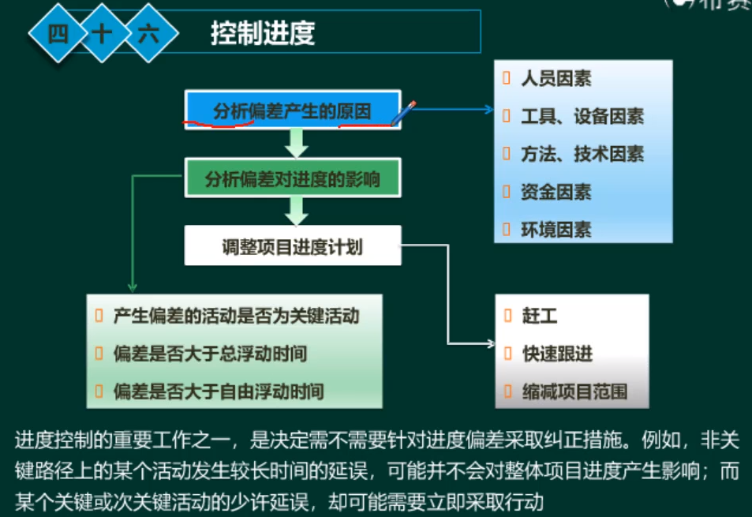
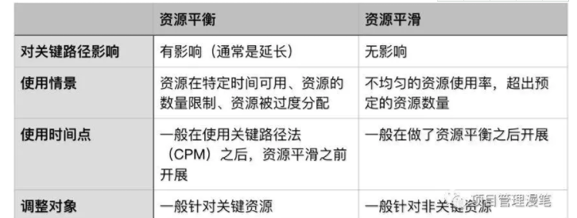

#项目进度管理

##规划进度管理

##定义活动

##排列活动顺序

  * FS：前面一个结束之后，后面一个才可以开始
  * FF：前面一个结束之后，后面一个才可以结束
  * SS：前面一个开始之后，后面一个才可以开始
  * SF：前面一个开始之后，后面一个才可以结束

##估算活动持续时间
考虑风险的估算：三点估算
储备分析：预留的资源/时间
  * 应急储备：应对已经识别的风险（pm可支配）
  * 管理储备：应对未知的风险（pm不可支配）

##制定进度计划

####进度压缩
  * 赶工：加班/增加资源

####进度计划种类
  * 项目进度网络图：一般的图
  * 横道图（甘特图）：向管理层汇报
  * 里程碑图：向更高级管理层汇报

##控制进度

####资源优化技术

