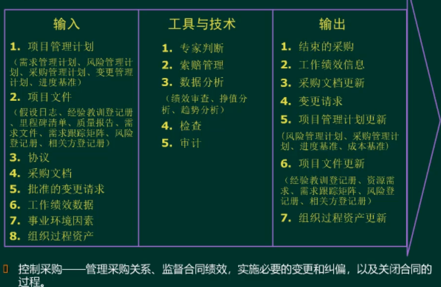

#项目采购管理

  * 卖方（乙方）：承包商、供货商、服务提供商，属于投标人。
  * 买方（甲方）：产品所有人、分包商、服务需求方

##采购管理过程

####合同类型

  * 总价合同：卖（乙）方承担风险，可以确认工作范围
    * 固定总价合同：买方风险最小的合同。
    * 总价加激励合同：
    * 总价加经济调整合同：
  * 成本补偿合同：买（甲）方承担风险，无法确认工作范围
    * 成本加固定费用合同：
    * 成本加激励费用合同：买方风险最小的合同。
    * 成本加奖励费用合同：
  * 工料合同：双方分担风险

##规划采购管理

##实施采购

##控制采购

####采购冲突
谈判-仲裁（ADR）-诉讼
  * 使用一种替代纠纷解决方案包括ADR
